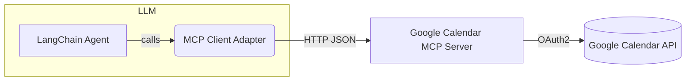

# Google Calendar MCP Agent with LangChain

*Last updated: 2025-06-12*

---

## 1. Architecture



| Layer | Responsibility | Tech |
|-------|---------------|------|
| **LLM Agent** | Generates plan, chooses calendar tools | LangChain ReAct Agent |
| **MCP Client** | Discovers tools & resources from servers and converts them to LangChain `Tool` objects | `langchain-mcp-adapters` |
| **MCP Server** | Exposes Google Calendar events as `Resource`, CRUD as `Tool` | FastAPI + `mcp` SDK + `google-api-python-client` |
| **Google API** | Persistence & notification backend | Google Calendar REST v3 |

---

## 2. MCP Server Implementation (`gcal_mcp_server.py`)

```python
from google.oauth2 import service_account
from googleapiclient.discovery import build
from mcp import MCPServer, resource, tool
from pydantic import BaseModel, Field

SCOPES = ["https://www.googleapis.com/auth/calendar"]
CREDS = service_account.Credentials.from_service_account_file(
    "service_account.json", scopes=SCOPES)
gc = build("calendar", "v3", credentials=CREDS)
CAL_ID = "primary"

@resource(uri="gcal://events/{id}", mime_type="application/json",
          description="Google Calendar event")
class CalendarEvent(BaseModel):
    id: str
    summary: str
    start: str
    end: str
    location: str | None = None
    description: str | None = None

class _Create(BaseModel):
    summary: str
    start: str  # RFC3339
    end: str
    description: str | None = None

@tool(name="create_event", input_model=_Create, output_model=CalendarEvent)
def create_event(req: _Create) -> CalendarEvent:
    body = req.dict(exclude_none=True)
    body["start"] = {"dateTime": req.start}
    body["end"] = {"dateTime": req.end}
    ev = gc.events().insert(calendarId=CAL_ID, body=body).execute()
    return CalendarEvent(**{
        "id": ev["id"],
        "summary": ev["summary"],
        "start": ev["start"]["dateTime"],
        "end": ev["end"]["dateTime"],
        "description": ev.get("description")
    })

# list_events / replace_event / delete_event … omitted for brevity

app = MCPServer(resources=[CalendarEvent],
                tools=[create_event],
                title="Google Calendar MCP").app
```

### 2.1 Setup

```bash
pip install mcp fastapi uvicorn google-api-python-client
export GCAL_SA_JSON=service_account.json
uvicorn gcal_mcp_server:app --port 8080 --reload
```

---

## 3. LangChain Integration

```python
from langchain_mcp_adapters.client import MultiServerMCPClient
from langgraph.prebuilt import create_react_agent
from langchain.chat_models import ChatOpenAI

mcp_client = MultiServerMCPClient(base_urls=["http://localhost:8080"])
tools = mcp_client.load_tools()

agent = create_react_agent(
    llm=ChatOpenAI(model="gpt-4o-mini"),
    tools=tools,
    system_prompt="You manage Google Calendar via tools."
)

agent.invoke("明日 9:30 に30分の『日次スタンドアップ』を作成して")
```

The agent will automatically pick **create_event** with correctly‑formatted
arguments, then return a confirmation message.

---

## 4. Security & Best Practices

* **Least privilege** – Calendar‐only scopes.
* **Time‑zone safety** – Require RFC3339 with offset (`2025-06-13T09:30:00+09:00`).
* **Conflict check** – Add a `list_events` + duplicate guard to avoid double‑booking.
* **Rate limiting** – Cache `events().list()` results for a few seconds to conserve quota.
* **HTTPS** – Deploy behind a reverse proxy with TLS and AuthN if exposed publicly.

---

## 5. Extending the Agent

| Feature | How to add |
|---------|------------|
| **Reminders / Notifications** | Implement an MCP tool wrapping `gc.events().watch()` & push notifications. |
| **Multiple Calendars** | Include `calendarId` in resource URI `gcal://{{calendar}}/{{id}}` and switch via tool args. |
| **Natural‑language dates** | Pre‑process user input with `duckduckgo-dateparser` or `dateparser` before tool invocation. |
| **Meeting links** | Insert `conferenceData` when creating events (requires advanced Calendar API). |

---

## 6. References

* Model Context Protocol spec – <https://github.com/anthropics/mcp>
* LangChain MCP Adapter – <https://github.com/langchain-ai/langchain-mcp-adapters>
* Google Calendar API docs – <https://developers.google.com/calendar/api>
